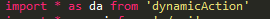

# 前端套路解读

## 1

- 目的：如果当前app所在的tab目前不显示，那么不输出东西
- 问题：_isCurrentTab哪里来的？

## 2

- 目的：使用reducer管理的app,再没有initView之前，render不输出东西
- 问题：payload哪里来的，utils哪里来的？

## 3

- 目的:获取state中的message信息，并展现
- 问题：message哪里来的？

## 4

- 目的:获取gettbyField和getter函数
- 问题：utils都有些啥？

## 5

- 目的：用dynamicComponent根据api设置的元数据显示界面
- 问题：dynamicComponent是怎么执行的？

## 6

- 目的：组件加载完，调用初始化视图方法
- 问题：initView应该做什么？

## 7

- 目的：如果props没变化，不再调用render
- 问题：它对性能的影响？

## 8

- 目的：让action具有dynamicAction的功能，reducer一样的机制
- 问题：下面这句话的意思？为啥不使用类？

## 9

- 目的：定义元数据
- 问题：这些属性哪里来的？完整的属性有哪些？

## 10
- Action:

- Reducer:

- Component:

- 目的：通过元数据路径获取组件各种属性
- 问题：运行机制？为啥action,reducer,component中写法不一致？getterByFeild机制？

## 11 

- 目的：重写getter
- 问题：什么场景用它？它是怎么被调用的？

## 12 

- 目的：用于下拉组件或者以后其他需要调用后台数据控件，在某个时机来获取需要的数据
- 问题：运行机制？

## 13 

- 目的：重写onEvent函数，用于组件发起的事件处理
- 问题：运行机制？

## 14

- 目的：重写onFieldChange函数，用于组件数据变化消息截获，并做相应处理
- 问题：运行机制？

## 15

- 目的：根据路径设置元数据属性值
- 问题：运行机制？

## 16

- 目的：使用我们字体的icon控件
- 问题：怎么查有哪些可用icon?

## 17

- 目的：公共样式处理
- 问题：什么样式该抽取到这里？如何分文件好？

## 18

- 目的：获取客户端上下文
- 问题：上下文有什么？哪些可以用？哪里设置的？

## 19

- 目的：调用webapi接口
- 问题：运行机制？如何使用promise方式调用？怎么增加webapi？

## 20

- 目的：使用元数据定义的校验规则
- 问题：运行机制？怎么增加校验规则？

## 21

- 目的：main入口
- 问题：都干嘛的？

## 22

- 目的：app配置
- 问题：啥时候用的？

## 23

- 目的：列表支持千分符
- 问题：如何实现的?如何添加更多的格式化？

