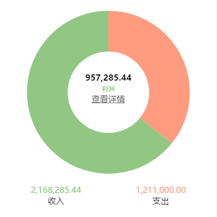

# 移动端解读
## 1,技术栈
## 2,项目结构
## 3,root
## 4,页面切换过程中，路由是怎么管理的
## 5,登录、微信绑定、解绑、重绑
## 6,图表
## 7,分享

---------------------------------------------------------------------------
## 1,技术栈
- 涉及技术：react,webpack,material Design
- material-ui rriconfont

## 2,项目结构
- 入口文件：src/index.js
- index.js ------> root
- root ----------> portal | landing
- landing ------->login|portal(wx)

## 3,root
- 

## 4,页面切换过程中，路由是怎么管理的
- 单页面开发，一点返回，灰飞烟灭，有必要处理返回键
- 

- 页面跳转通过上述三种方式，代码如下
- 

- 

- state中注册初始页面

- 

- 添加页面
- 

- 返回（最后一页有回调）
- 

## 5,登录、微信绑定、解绑、重绑
- root ----->landing
- landing:
- a,url 参数中没有code --->login,用户名密码登录
- b,url 参数中有code ----->webapi.mobile.getYiJiaLoginTicket,微信code检测该用户有没有绑定
- c,已绑定 this.props.onLoginSuccess('apps/portal', true) 进入程序
- d,未绑定 ------>login    {appData:{ticket:ticket}}
- login:
- props.appData中的ticket记录下来 配合用户名密码一起登录
- mine：
- 个人中心退出登录，解除绑定，跳转至login 带上ticket 方便下次登录绑定

## 6,图表
- g2-mobile
- 饼图
-  

- 

- 折线图
- 

- 

## 7,分享
- 由于缺少一次交互时机，进入页面配置好url和fileToken,分享成功后回调向服务端提交数据
- url da.getRootHost 做兼容
