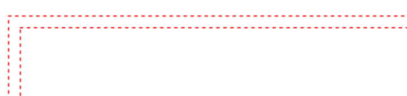

##为什么会出现浏览器兼容性问题?
>因为不同浏览器使用内核及所支持的HTML（标准通用标记语言下的一个应用）等网页语言标准不同；以及用户客户端的环境不同（如分辨率不同）造成的显示效果不能达到理想效果。最常见的问题就是网页元素位置混乱，错位。

##解决浏览器兼容性问题
>还是从三个方面入手：html部分、css部分

1.html部分
a、最突出也是最容易想到的就是高版本的浏览器用了低版本的浏览器无法识别的元素，从而导致不能解析。这点主要体现在html5的新标签上
解决办法是：htmlshim框架可以让低于IE9的浏览器支持html5

b、`<button>` ie的默认类型是 "button"， 而其他浏览器中（包括W3C 规范）的默认值是 "submit"，会自动提交表单，所以要加上type="button"。（谷歌浏览器中好像有处理这个问题）

c、`` 标签的alt属性
图片无法显示，然后在chrome中显示的是一张破损图片的样子，alt里的文字无法显示；
在firefox只是显示alt里的文字；
在IE显示的是破损图片+alt文字。

d、表单input按钮，它在各大浏览器中的情况如下：

解决办法：统一修正样式，字体大小，高度问题，padding、、、

2.css部分
a、css的hack问题：主要针对IE的不同版本，不同的浏览器的写法不同
IE的条件注释hack：
	<!--[if IE 6]>此处内容只有IE6.0可见<![endif]-->   
	<!--[if IE 7]>此处内容只有IE7.0可见<![endif]-->

b、css3，新属性border-radius、box-shadow、transition过渡动画、transform变型、animation自定义动画等等
加浏览器私有属性前缀（-webkit-为Chrome/Safari*、-moz-为Firefox、-ms-为IE、-o-为Opera）

c、flex布局
加浏览器私有属性前缀
在移动端，由于都使用webkit内核，所以可以使用。但有一个例外：安卓上的低版本的uc浏览器支持不好。
display		display: -webkit-box; display: -webkit-flex; 
justify-content		-webkit-box-pack: center; justify-content: center;
flex	-webkit-box-flex: 1; -moz-box-flex: 1; -ms-flex: 1;  

d、IE的双边距bug 
设置为float的div在ie下设置的margin会加倍。这是一个ie6都存在的bug。 
解决方案：在这个div里面加上display:inline; 

e、IE 低版本中的最小高度问题
ie6下它的最小高度是19px,IE 6 下元素的高度如果小于 19px 的时候，会被当做 19px 处理
解决办法：overflow: hidden;

f、 IE 中的边框 border: 1px dotted red;
在标准浏览器中：

而 IE 6 下是一个什么样子呢？？

g、ie8以下透明度失效
解决办法:filter:alpha(opacity = 50)
opacity针对高版本及主流浏览器，第二个兼容ie低版本用的

h、input 元素的 BUG
在 IE 6 和 IE 7 中，输入型表单控件上下会有 1px 的间隙。
解决办法：float:left

j、固定定位 BUG
 IE 浏览器中，你会发现，咱们设置的 固定定位失效了！

##项目中的兼容性问题
>ie和eage下，税务-企业所得税-附表2-界面错误

加伪元素
position:relative导致border消失
解决方法：把合二为一的边框变成默认值，在去掉这个元素的下边框和右边框

>ie下，新增凭证z-grid消失，flex:1引起的，

解决方法：把flex:1改为flex:inherit

>Edge-科目期初-期初余额-表头期初俩字颠倒了

解决办法：加diaplay:ruby(将对象作为表格脚注组显示)

>eage下增值税附表中没有滚动条，导致表格显示不完整

解决办法：设置colflex1的height: 0px;

>火狐和ie上表头与表行的错位(资产负债表，利润表，增值税申报表)

解决办法：

>兼容ie11上表格的表頭是白色的缺陷

##caniuse.com 在线查看元素属性兼容性工具

##总结解决兼容性问题技巧：

1、检查看到底是哪个属性存在问题，找到以后，就针对这个属性找兼容它的办法，实在不行，找捷径。

2、用hack，写针对这个浏览器的特定样式

3、看到css3属性，就加私有前缀呗

5、只要有耐心，慢慢找，总能兼容它。

