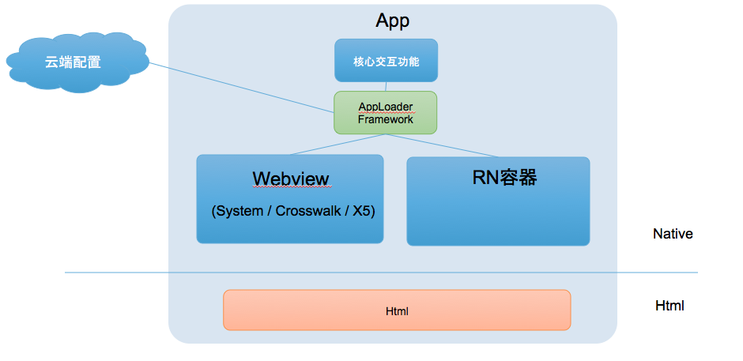
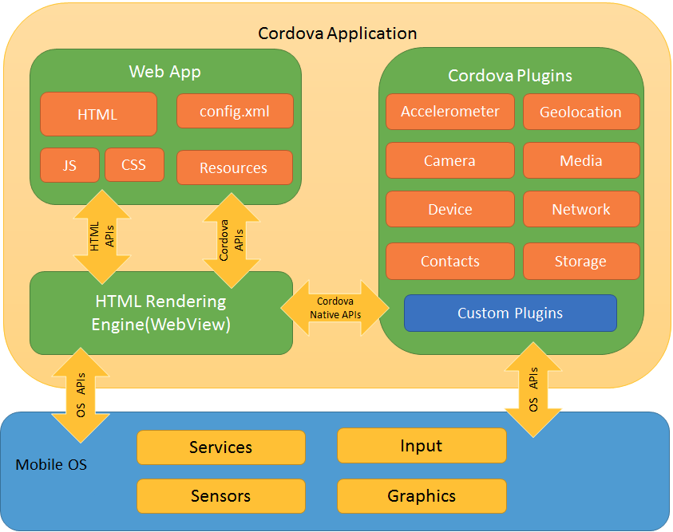
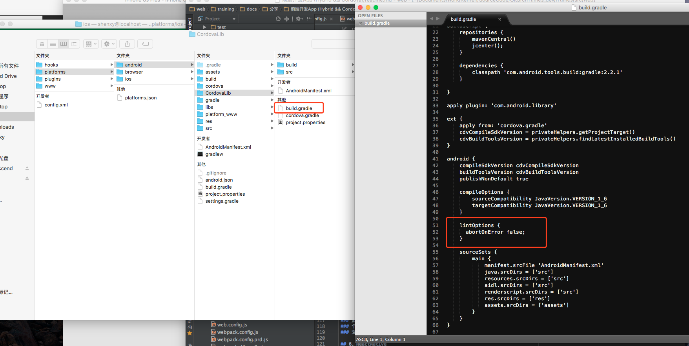

# 前端开发App 

## 0、App开发的基本套路

### 1) 纯Native
- Android(Java)
- iOS(Objective-C、Swift)

### 2) Hybrid混合式
- Native(强调交互体验 + 手机能力)
- H5(频繁更新、动态变化)

### 3) ReactNative、Weex等模式
- 兼有Native的性能 + H5的灵活
- 兼有Native的复杂 + H5的性能

### 目前主流还是Hybrid

## 1、Hybrid混合式开发App

### 原理: 使用Webview组件加载网页, 通过Js-Bridge来实现js和native的交互

### 图解:


### 当年产品(工作圈)的接口文档(Gitbook, 2016-06):
[工作圈markdown](~/Documents/work/Teamwork/GitBook/Library/gongzuoquan/gzq/native/index.md)

### 一个主流的框架:Cordova

## 2、Crodova框架作用

### 官网: http://cordova.apache.org
- 官方说明: Apache Cordova is an open-source mobile development framework. It allows you to use standard web technologies - HTML5, CSS3, and JavaScript for cross-platform development. Applications execute within wrappers targeted to each platform, and rely on standards-compliant API bindings to access each device's capabilities such as sensors, data, network status, etc.
- 历史: Phonegap 被捐给Apache基金会以后, 重命名Cordova

### 架构图解:


### 原理:
- 三部分: Webview、Web App、Cordova Plugins, 可以分别扩展
- Js端,加载cordova.js
- Native端, 加载CordovaLib
- 通过cordova框架的JsBridge来实现js和native的交互(原理细节略)

## 3、开发步骤:
分三步: 建好Native工程, 把H5项目放进去, 打包运行

### 1) Cordova安装/升级: 
```
$ npm install -g cordova
```

### 2) 创建工程:
```
$ cordova create MyApp com.shenxy.MyApp
```

### 3) 添加平台:
```
$ cd MyApp

$ cordova platform add browser

$ cordova platform add android

$ cordova platform add ios
```

### 4) 编译准备: 
因为虽然不需要手写代码,但是需要编译: (其实主要时间花在这里...)

- Android编译准备: http://cordova.apache.org/docs/en/latest/guide/platforms/android/index.html
1. JDK7 及以上
2. Android SDK (Android Stand-alone SDK Tools or Android Studio)
3. Adding SDK Packages (Platform SDK for your targeted version\build-tools version 19.1.0 or higher)
4. Setting environment variables
5. Gradle (编译环境)

- iOS环境: http://cordova.apache.org/docs/en/latest/guide/platforms/ios/index.html
0. Mac
1. Xcode
2. Deployment Tools
```
$ npm install -g ios-deploy
```

### 5) 编译运行:

- 用Cordova的命令运行:

 浏览器查看, 执行命令:
```
$ cordova run browser
```

 iPhone运行, 执行命令:
```
$ cordova run ios
```

 android运行, 执行命令: 
```
$ cordova run android
```


- 也有可能编译过程报错, 是自动生成的代码没走心:


- 也可以分步骤自己执行编译\安装\运行
```
$ cd android
$ cordova build android
$ cd build/outputs/apk
$ adb install -r android-debug.apk
$ adb shell am start -n com.shenxy.MyApp/com.shenxy.MyApp.MainActivity
```
    
### 6) 添加Native插件(可选)
- 增加插件,例如Camera
```
$ cordova plugin add cordova-plugin-camera
```
- 修改www下的前端html,增加调用
```
<body>
    <script type="text/javascript" src="cordova.js"></script>
    <script type="text/javascript" src="cordova_plugins.js"></script>
    <script type="text/javascript" src="js/index.js"></script>
    <script type="text/javascript">
            function showCamera() {
                navigator.camera.getPicture(
                    function(res) {
                        alert(res);
                    }, 
                    function(res) {
                        alert(JSON.stringify(res));
                    }, 
                    { 
                        quality: 50,
                        destinationType: Camera.DestinationType.FILE_URI 
                    });
            }
        </script>
        <div class="app">
            <h1>Apache Cordova</h1>
            <div id="deviceready" class="blink">
                <p class="event listening">Connecting to Device</p>
                <p class="event received">Device is Ready</p>
            </div>
            <div>
                <input type="button" onclick="javascript:showCamera();" value="拍照" />
            </div>
        </div>
    </body>
```
- 编译运行, 见证一下

### 7) 添加自己的前端工程
把webpack打包出来的dist文件夹, 所有内容拷贝到www文件夹,然后重新打包即可 

### 8) 调试

- chrome的正常的调试网页

- chrome直接调试Android运行环境的webview
chrome://inspect


## 4、马达马达——

### 1) 个性化Native接口
- 官方有大量的可用插件 (有些比较凑活)
```
$ cordova plugin add cordova-plugin-camera
```
- 可以扩展自定义插件(工作圈做了58个自定义插件),但是需要native端的开发

### 2) 平台兼容性
- Android和iOS平台的cordova.js是不同的
- cordova平台和微信平台是不同的
- browser平台是没有native能力的
- 在不同平台上,做插件是使用不同技术的

### 3) 浏览器兼容性
- 打包webview的浏览器内核
- cordova官方推荐crosswalk(有多种模式, 单独议题)
- 也可以打包腾讯X5等其他开放内核

### 4) 多样化的加载
- Zip离线包方式
- RemoteUrl的在线方式
- ReactNative方式

### 5) 文件缓存\更新
- 需要服务端配合
- 版本检查
- 差量更新

## 5、ReactNative
### 1) 与webview的方案, 原理不同, 但是从app角度看, 架构类似
- 都是使用H5来实现业务, 包装一个App的"壳"
- 都通过JsBridge, 来实现js和native的交互(使用native能力)
- 都可以通过命令行创建"壳"App, 方便前端同学直接上手, 实现前端同学"大前端"构想

### 2) 使用方法和cordova类似
- 官网:http://facebook.github.io/react-native/docs/getting-started.html#content
- 命令行摘要:
```
$ npm install -g react-native-cli
$ react-native init AwesomeProject
$ cd AwesomeProject
$ react-native run-android
$ react-native run-ios
```
- iOS相对成熟, Android相对不完善
- 工作圈的低耦合集成尝试(动态下载插件app, 作为RN的运行时)


